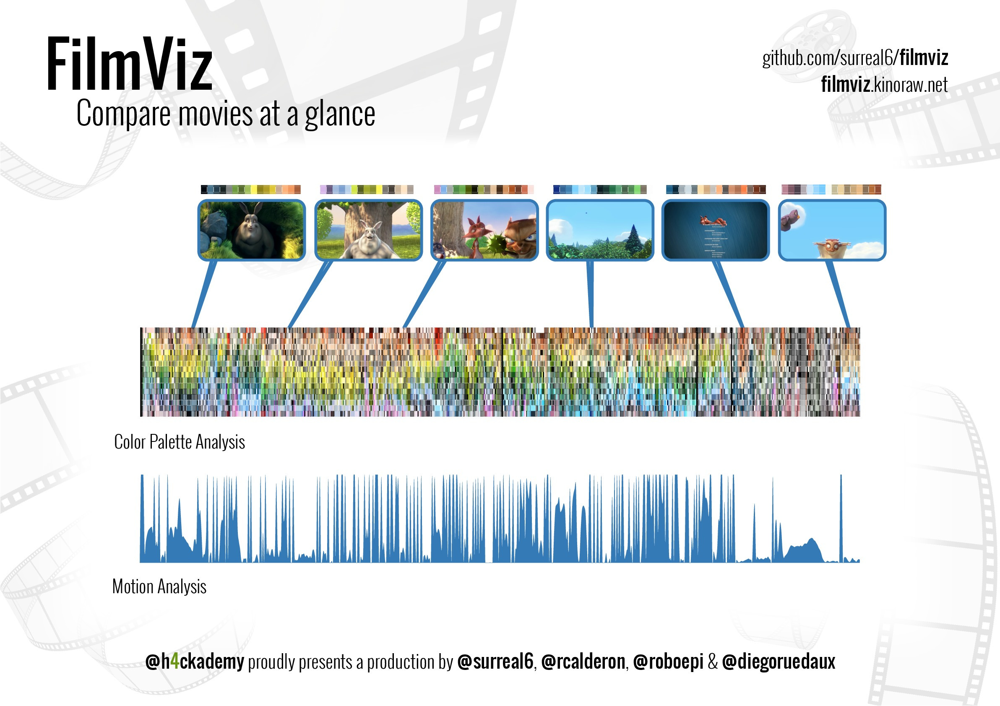
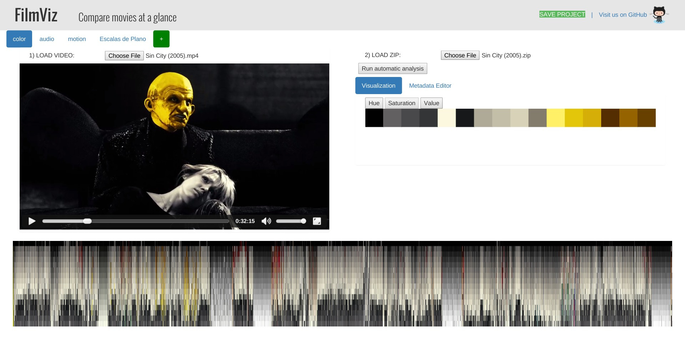
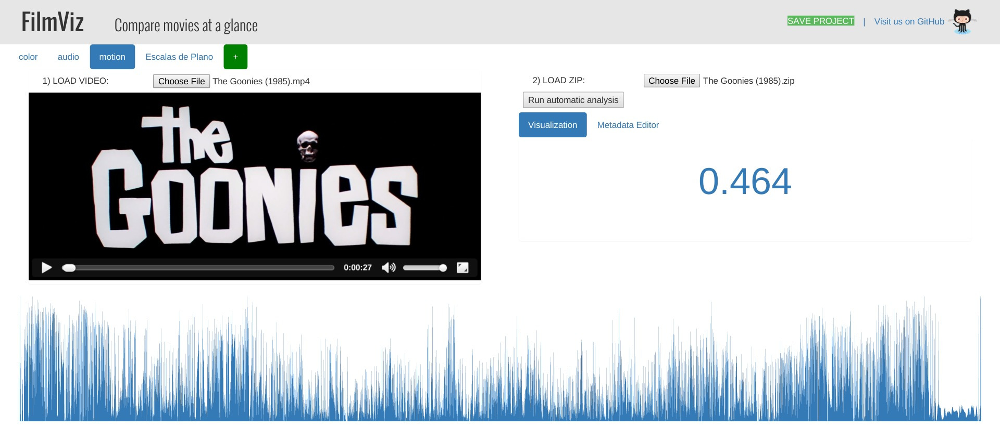
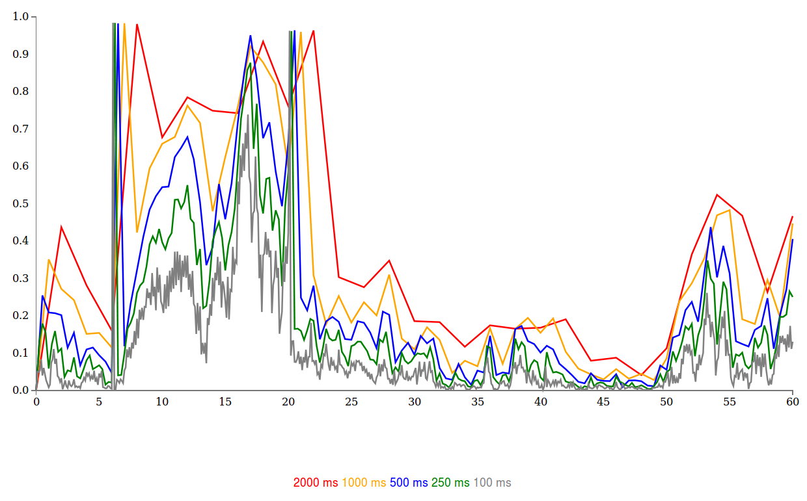

# FilmViz

## About the project

There are many film analysis on the internet, particularly of color. Some are manual and subjective, some analyze just a frame while others span the whole film, and many use their own private tools. 

That's why we're building **FilmViz**: a web tool that helps you **analyze** your favorite films, **compare** them in a visual way and **share** your discoveries with others.

We want to provide a **common tool** for film analysis and comparison to the community.




### Description

The final aim of this project is to build an online database of film analysis that allows users to visually compare different aspects of films, such as their main colors, their motion or rhythm through the number of cuts, the amount of dialogue and music, etc. Combining all this information will allow you to understand the whole picture.

The project is inspired by a number of independent analysis of different films that are available out there (such as [this](http://moviesincolor.com/), [this](http://moviebarcode.tumblr.com/), [this](http://www.smartjava.org/examples/movie-viz/index.html), [this](http://www.smartjava.org/examples/movie-viz/batman.html) or [this](http://fathom.info/rocky/)).

### Objectives

The first logical step is to build a **film analysis tool**. The tool will run locally in the browser and will perform automatic color, motion and audio analysis, and will also allow the user to manually input additional metadata (such as types of camera shots, actors in the shots or a day/night classification). The tool will show visualizations for all the data gathered as well. Once the analysis is done, the user will be able to share it by uploading it to an online database.

The second part of the project would be to build an **online film analysis database**, to which users will upload the analysis performed locally with the tool. A website will display visualizations for all the film analysis uploaded, and will allow users to see comparisons between films.

### Sample images

It's still a work in progress, but we can already get automatic analysis for color and motion. 

#### Here you can see the color analysis of Sin City. 

Uhm, let's see... where does the yellow character appear on screen? Yep, you guessed it.You can also add your own tags to measure any other aspect of the film you want, and the tool can even tell you things like the number and duration of cuts.



#### Another example: The Goonies. 

Here you can appreciate the rhythm of the film through the motion analysis.



### Test it!

You can try an early prototype of the analysis tool at [filmviz.kinoraw.net](http://filmviz.kinoraw.net) (kinoraw are kindly hosting us for now)

### Tell us what you think

Follow us on Twitter (@filmviz) to get updates about the project. We're eager to hear what you think, so please don't hesitate to come talk to us.

## Installation  

Before you can run a development version of FilmViz you need to install the `bower` dependencies. Execute this command on a terminal:
```
bower install
```
(You need to [install](https://nodejs.org/download/) `node.js` first and run `npm install bower -g` to install `bower`)

That's it! Now you can run a static HTTP server and enjoy FilmViz:
```
python -m SimpleHTTPServer 8000  # Python 2
python -m http.server 8000  # Python 3
```

Then go to `http://0.0.0.0:8000/`. Please keep in mind that the development is still in early stages. A lot of things are broken or not implemented yet.


## Tips for contributing

We follow the rules of JavaScript Code Style [from Airbnb](https://github.com/airbnb/javascript).

You'll fit better with us if you install `jscs` with `npm install jscs -g` an run `jscs your-file-or-path` before requesting a pull.

Every contribution is appreciated, but they will be better if they cause a good impression to us. Thanks!


## Documentation

### Findings

We run some tests to figure out an acceptable sample rate for the motion analysis, since we needed to find the right balance between accuracy and the time the analysis takes: getting a lot of samples per second would make the analysis unbearably slow, but getting too few would affect our ability to detect cuts in the video.

We performed a few motion analysis for the same one minute video with different sample rates. The results can be seen in the graph below (the x axis is time, while the y axis indicates the motion difference between two samples, ranging from 0 to 1). The video used for testing has two cuts, around second 6 and second 20.



- For 2000 ms, the analysis took 8.143 s (13.6% of the video duration)
- For 1000 ms, the analysis took 17.119 s (28.5% of the video duration)
- For 500 ms, the analysis took 36.136 s (60,2% of the video duration)
- For 250 ms, the analysis took 71.847 s (120% of the video duration)
- For 100 ms, the analysis took 182.665 s (304% of the video duration)

We concluded that getting a frame every half second (500 ms) will be good enough for our application. This conclusion is however susceptible of being revisited in the future.


### References

#### WebVTT
- http://dev.w3.org/html5/webvtt/
- https://developer.mozilla.org/en-US/docs/Web/API/Web_Video_Text_Tracks_Format

#### Color analysis
- http://moviesincolor.com/
- http://moviebarcode.tumblr.com/page/7
- http://thecreatorsproject.vice.com/blog/visualizing-a-movies-color-footprint
- http://www.smartjava.org/examples/movie-viz/index.html
- http://www.smartjava.org/examples/movie-viz/batman.html
- http://www.smartjava.org/content/movie-color-analysis-xbmc-boblight-java-and-d3js
- https://en.wikipedia.org/wiki/Color_quantization
- http://www.runtime-era.com/2011/11/grouping-html-hex-colors-by-hue-in.html
- http://paletton.com/widget/

#### Motion analysis
- http://cinemetrics.lv/cinemetrics.php
- http://huddle.github.io/Resemble.js/

#### Audio analysis
- https://en.wikipedia.org/wiki/Voice_activity_detection
- http://dsp.stackexchange.com/questions/1499/how-to-extract-vocal-part-from-stereo-audio-signal
- https://www.math.ucdavis.edu/~aberrian/research/voice_separation/
- https://github.com/corbanbrook/dsp.js/

#### Metadata analysis
- http://fathom.info/rocky/
